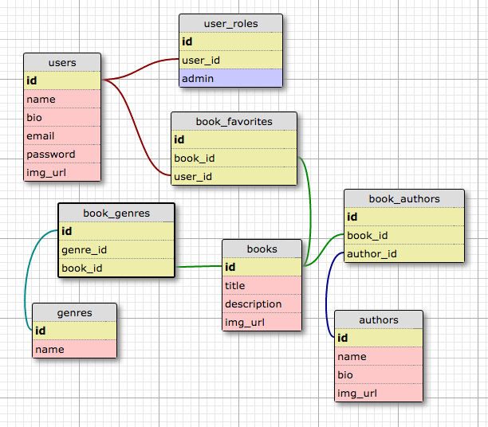

#Description

Create a simple content management system that allows users to add, delete, or update books. Books entered in the system can be viewed in a listing, or searched for using basic searches (title, author, genre).

##Context

Creating this web application will provide exposure to:

- Express (or other web framework)
- Javascript
- Simple relational database interactions (Create, Read, Update, Delete), with SQL practice
- Simple server side templating (to render data retrieved from the database)

##Specifications

- [X] Users can sign up and log into their account.  **100% complete**
- [ ] Admin users can add, delete, edit books into the system via an admin page. **90% complete** We can add books, delete books, and we made progress on editing, but didn't complete in time.
- [X] Books entered in the system are listed on the home page, in pages of 10 **100% complete**
- [X] Users can search for books by title OR by author OR by genre, and search results will be presented in a new page. **100% complete**
- [ ] Users can refine search by genre & other methods. (faceted search) **95% complete** We're *so close* to being done with this, we just couldn't get the bugs out in time :<

- [X] Users can view book details on a book detail page, linked to from the listing or search pages. **100% complete**
- [X] All code submissions are peer reviewed via GitHub PR by at least two members of the team, and master is always in a stable state (tests passed, site functions) **100% complete**
- [X] Test driven development for sql queries **100% complete**

###Required

- [X] The artifact produced is properly licensed, preferably with the MIT license. **100% complete**
Quality Rubric

- [X] Code is well formatted without any linting errors **100% complete**
- [X] Variables, functions, css classes, etc. are meaningfully named (no comments exist in code to explain functionality - the names serve that function) **100% complete**
- [X] Functions are small and serve a single purpose **100% complete**
- [X] Code is well organized into a meaningful file structure **100% complete**
- [X] Code is reasonably tested with a test suite **100% complete**
- [X] Interface is user friendly **100% complete**

###Resources

Model -
http://ondras.zarovi.cz/sql/demo/

###Creative Commons License

This work is licensed under a Creative Commons Attribution-NonCommercial-ShareAlike 4.0 International License.
